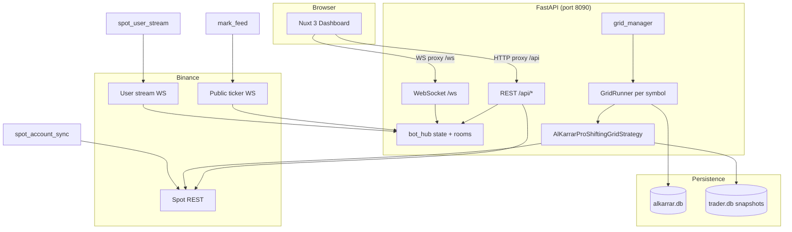

# AlKarrar Pro — System Architecture

This document describes how the backend engine, frontend dashboard, and Binance integrations fit together. For **financial strategy rationale**, see [docs/TRADE_LOGIC.md](docs/TRADE_LOGIC.md).

---

## High-level diagram

---

## Runtime processes (API lifespan)

On `uvicorn` startup (`backend/api/app.py`):

1. **init_db** — SQLite schema for settings, fills, audit logs.
2. **hub.replace_state** — Load `bot_settings` row into in-memory hub.
3. **spot_account_sync** — Initial REST balance pull.
4. **maintenance_tasks** — Purge old audit/fills (24h loop).
5. **Background tasks:**
   - `mark_feed.run_mark_price_feed` — Combined `@ticker` streams for active grid symbols.
   - `spot_account_sync.run_account_sync_loop_env` — Periodic REST wallet sync.
   - `spot_user_stream.run_spot_user_stream` — `executionReport` → trade journal (may fail on demo).
6. **grid_recovery** — Reconcile snapshot env/key fingerprints; auto-resume grids with `autoResume=true`.

On shutdown: `grid_manager.stop_all(manual=False)` persists resume snapshots, then cancels background tasks.

---

## Layer responsibilities

### Frontend (`frontend/`)

| Piece | Role |
|-------|------|
| **Nuxt 3** | SPA; dev proxy to API (`nuxt.config.ts` → `127.0.0.1:8090`). |
| **Pinia `stores/bot.ts`** | WS client, hub state, per-symbol marks, ledger merge, trades. |
| **Components** | `TradingChart`, `GridCard`, `TradeJournal`, `GridLedgerPanel`, `EmergencyBar`. |

The browser never receives raw API secrets; preview is last-4 only via BFF.

### API / BFF (`backend/api/`)

| Module | Role |
|--------|------|
| **bot_hub** | In-memory state + WebSocket fan-out; per-symbol rooms for multi-grid. |
| **grid_manager** | One `GridRunner` per symbol; allocation validation against live USDT. |
| **grid_runner** | Client lifecycle, FIFO ledger, mark ticks → strategy, reconcile after resume. |
| **credential_resolver** | Keys from `.env`; env from `binance_key_probe` when enabled. |
| **spot_realized_ledger** | FIFO buy lots; `validate_grid_economics` pre-flight. |
| **grid_live_ledger** | In-memory UI audit (400 rows/symbol); not SQLite. |
| **grid_snapshot_store** | `shifting_grid_snapshots` in `data/trader.db` for crash recovery. |
| **portfolio_risk** | Per-grid trailing equity stop; isolated from wallet-wide noise. |
| **emergency_service** | Cancel all, market sell base, freeze ledger. |

### Strategy (`backend/strategies/`)

| Module | Role |
|--------|------|
| **alkarrar_pro_shifting_grid** | Band RAM, trailing phases, bootstrap (optional), grid shift, virtual execution. |
| **virtual_grid_book** | Armed lines, cross detection, execution throttle, snapshot rows. |

### Core (`backend/core/`)

| Module | Role |
|--------|------|
| **binance_client** | Async python-binance wrapper per env. |
| **binance_env** | Host routing for REST/WS. |
| **binance_key_probe** | Auto-detect env; credentials fingerprint. |
| **exchange_filters** | Parse `exchangeInfo`; quantize price/qty. |

---

## Data stores

| Store | Path | Contents |
|-------|------|----------|
| **alkarrar.db** | `data/alkarrar.db` | `bot_settings`, `trade_fills`, `bot_audit_logs`, orders |
| **trader.db** | `data/trader.db` | `shifting_grid_snapshots` (JSON payload per bot+symbol) |
| **Hub RAM** | Process memory | Live dashboard fields, marks, WS subscribers |
| **Strategy RAM** | Per runner | Virtual lines, trailing state, dedupe sets |

---

## WebSocket message types (browser)

Common `type` values on `/ws`:

- `snapshot`, `metrics`, `settings`, `mark`, `order`, `trade`, `grid_metrics`, `grid_ledger`, `trades_refresh`, `emergency`, `sync_error`

Room broadcasts target active symbol when multi-grid is enabled.

---

## Mark → grid tick pipeline

1. `mark_feed` receives ticker → `hub.merge_room(symbol, { markPrice })`.
2. `grid_manager.dispatch_mark(symbol, price)` → `GridRunner.on_mark`.
3. Runner polls new `myTrades`, drains pending realized delta.
4. `strategy.on_tick` → boundary eval, shift, trailing, virtual crosses.
5. Crossed line → `_execute_virtual_line` → LIMIT IOC (default) on Binance.
6. Fill callback → FIFO ledger + `trade_journal` upsert + WS refresh.

---

## Security boundaries

- Secrets: **`.env` only** for trading (see `credential_resolver.py`).
- CORS: localhost dev origins in `app.py` (tighten for production deployment).
- Snapshots: include `credentialsFingerprint` — resume blocked on key/env mismatch.
- No private keys in repository; `.gitignore` blocks `.env` and `data/*.db`.

See [SECURITY.md](SECURITY.md).

---

## Deployment notes

- Run API behind HTTPS terminator in production; set `NUXT_PUBLIC_API_BASE` / `NUXT_PUBLIC_WS_URL` if frontend is not proxied.
- Use process manager (systemd, Docker) with restart policy; auto-resume handles grid continuity.
- Monitor disk growth; maintenance task prunes audit/fills by retention env vars.

---

## Extension points (for contributors)

- New strategies: implement `BaseStrategy`, wire in `grid_runner` (keep grid_manager contract).
- New exchanges: implement `BaseExchange` in `backend/core/` (large effort).
- Dashboard widgets: consume existing WS types before adding new hub fields (document in PR).
