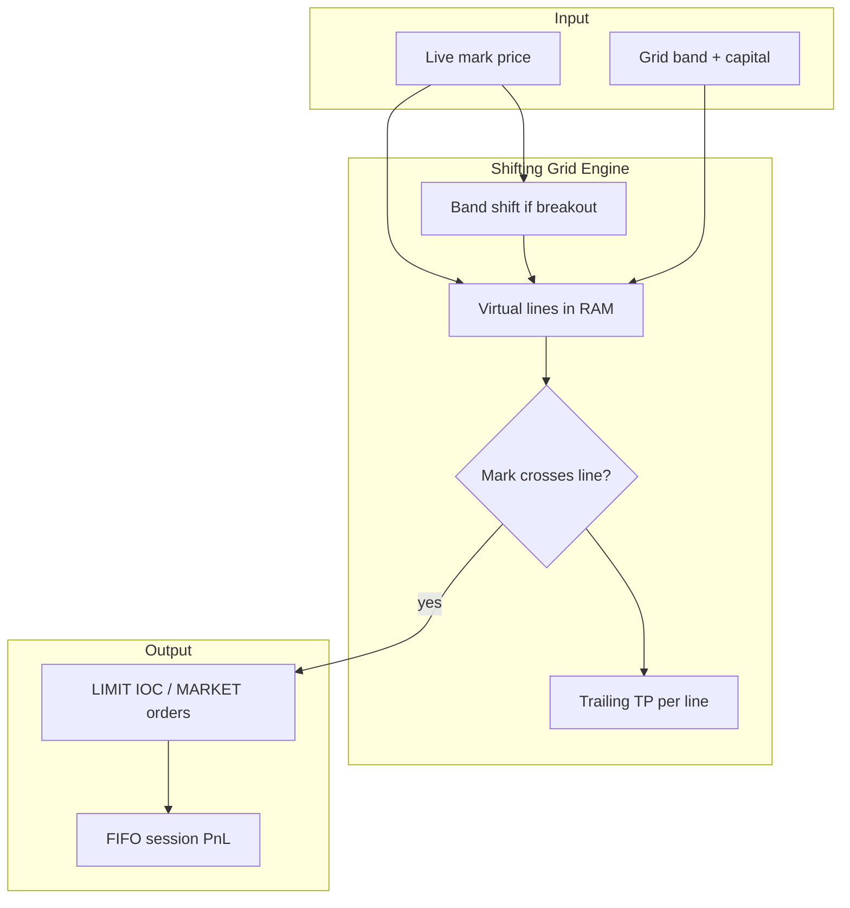

# AlKarrar Pro

**Open-source Binance Spot grid trading engine** with a live Nuxt dashboard, virtual shifting grids, session-isolated PnL, and production-grade resilience (auto-resume, env auto-detection, DB retention).

Official repository: [github.com/ad5077579-design/AlKarrar](https://github.com/ad5077579-design/AlKarrar)

### How the strategy works (at a glance)



More diagrams: [docs/STRATEGY_DIAGRAMS.md](docs/STRATEGY_DIAGRAMS.md) · **Custom strategies welcome:** [docs/PLUGINS.md](docs/PLUGINS.md)

> **Risk disclaimer:** Trading cryptocurrencies carries significant risk. This software does not provide financial advice. Test thoroughly on [Binance Spot Demo](https://demo.binance.com) or [testnet](https://testnet.binance.vision) before mainnet. You are solely responsible for your API keys and capital.

---

## Features

| Capability | Description |
|------------|-------------|
| **Shifting Grid** | Dynamic band recenters when price breaks out; virtual lines fire on mark crosses (no resting limit wall). |
| **Session-isolated PnL** | FIFO realized ledger per grid session; floating PnL for open inventory. |
| **Auto-compounding** | Optional lot resize when cumulative realized profit crosses a threshold. |
| **Trailing take-profit** | Per-line lock-profit → trailing peak → IOC/market exit. |
| **Multi-grid** | One `GridRunner` per symbol with portfolio allocation checks. |
| **Emergency stop** | Cancel open orders, flatten base, freeze ledger; per-symbol or global. |
| **Anti-race guards** | IOC cooldown, order-id dedupe, mutex per line, ledger dedupe by `orderId`. |
| **Crash recovery** | SQLite snapshots + auto-resume after API restart (env/key fingerprint match). |
| **Env auto-detect** | Probes demo / mainnet / testnet from API keys (`ALKARRAR_AUTO_DETECT_BINANCE_ENV`). |
| **Live filters** | `exchangeInfo` LOT_SIZE, PRICE_FILTER, MIN_NOTIONAL per symbol at grid start. |

---

## Screenshots & UI

The dashboard (`frontend/`) provides:

- Live mark feed and candle chart (klines via BFF)
- Per-symbol grid cards, virtual ladder preview, trailing line status
- Trade journal (session fills), grid audit ledger (in-memory), SQLite audit trail
- Emergency bar, compounding / drawdown panels

*(Add `docs/images/dashboard.png` when publishing — placeholder for contributors.)*

---

## Quick start

### Prerequisites

- **Python 3.11+**
- **Node.js 18+** (for Nuxt 3)
- Binance Spot API keys ([demo](https://demo.binance.com) recommended first)

### 1. Clone and install

```bash
git clone https://github.com/ad5077579-design/AlKarrar.git
cd AlKarrar
python -m venv .venv
# Windows: .\.venv\Scripts\Activate.ps1
# Linux/macOS: source .venv/bin/activate
pip install -r requirements.txt
cd frontend && npm install && cd ..
```

### 2. Configure environment

```bash
cp .env.example .env
# Edit .env — add BINANCE_API_KEY / BINANCE_API_SECRET (never commit .env)
```

Verify keys and detected environment:

```bash
python scripts/probe_binance_env.py --no-cache
python scripts/test_binance_spot_keys.py
```

### 3. Run (Windows)

```powershell
.\restart_all.ps1
```

Or separately:

```powershell
.\scripts\run_api.ps1      # http://127.0.0.1:8090
.\scripts\run_frontend.ps1 # http://127.0.0.1:3000
```

Open **http://127.0.0.1:3000** — API and WebSocket are proxied via Nuxt in development.

### 4. Run tests

```bash
python -m pytest backend/tests -q
```

---

## Documentation map

| Document | Audience |
|----------|----------|
| [ARCHITECTURE.md](ARCHITECTURE.md) | System design, processes, data flow |
| [docs/TRADE_LOGIC.md](docs/TRADE_LOGIC.md) | **Why** the strategy works this way (whitepaper) |
| [CONTRIBUTING.md](CONTRIBUTING.md) | Pull requests, safety rules |
| [SECURITY.md](SECURITY.md) | Secrets and vulnerability reporting |
| [AGENTS.md](AGENTS.md) | Maintainer / AI agent operational reference |
| [.env.example](.env.example) | All environment variables |

---

## Binance environments

| `BINANCE_ENV` (hint) | Create keys at | Use case |
|----------------------|----------------|----------|
| `demo` | [demo.binance.com](https://demo.binance.com) | Default; paper Spot demo |
| `testnet` | [testnet.binance.vision](https://testnet.binance.vision) | Legacy testnet |
| `mainnet` | binance.com | Real funds |

With `ALKARRAR_AUTO_DETECT_BINANCE_ENV=true` (default), the engine **probes** which host accepts your keys; `.env` hint is tried first, then demo → mainnet → testnet.

---

## Project layout

```
AlKarrar/
├── backend/
│   ├── api/              # FastAPI BFF, WS hub, grid manager, sync feeds
│   ├── core/             # Binance client, env routing, key probe, filters
│   ├── strategies/       # Shifting grid + virtual grid book
│   ├── database/         # SQLAlchemy models (SQLite)
│   └── tests/
├── frontend/             # Nuxt 3 + Pinia dashboard
├── scripts/              # run_*, health_check, probe_binance_env
├── data/                 # Local SQLite (gitignored)
├── docs/                 # Trade logic & deep dives
└── AGENTS.md             # Extended runbook
```

---

## API overview

| Method | Path | Purpose |
|--------|------|---------|
| GET | `/api/bots/{bot_id}/dashboard` | Snapshot + account sync |
| POST | `/api/bots/{bot_id}/grid/start` | Start shifting grid |
| POST | `/api/bots/{bot_id}/grid/stop` | Stop grid (manual → no auto-resume) |
| POST | `/api/emergency_stop` | Flatten + stop |
| WS | `/ws` | Live metrics, marks, grid events |

Full contract: see [AGENTS.md](AGENTS.md) and [ARCHITECTURE.md](ARCHITECTURE.md).

---

## License

[MIT](LICENSE) — see file for trading disclaimer.

---

## Contributing

We welcome issues and pull requests. Read [CONTRIBUTING.md](CONTRIBUTING.md) before changing strategy or risk code.

**Have your own strategy?** Implement `BaseStrategy` and open a PR — see [docs/PLUGINS.md](docs/PLUGINS.md). No need to fork the shifting grid internals; a clean plugin registry is a great contribution.

**Arabic quick note / ملاحظة:** المشروع يدعم بيئة Demo افتراضياً؛ راجع `docs/TRADE_LOGIC.md` و`.env.example` قبل التشغيل على أموال حقيقية.
