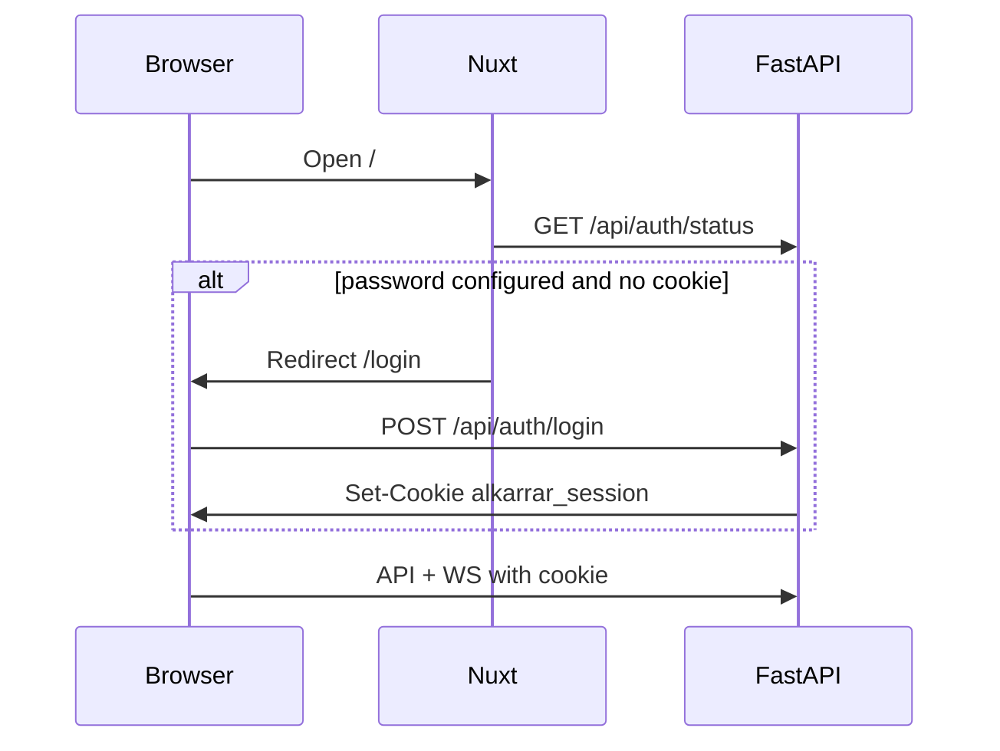

# Dashboard login

AlKarrar Pro can run **without** login during local development. For any deployment reachable from a network, set a dashboard password on the **API server** (`.env`), not in the browser.

## Enable

```env
ALKARRAR_DASHBOARD_USERNAME=admin
ALKARRAR_DASHBOARD_PASSWORD=your-strong-password-here
ALKARRAR_AUTH_SECRET=long-random-string-not-equal-to-password
```

Restart the API after changing `.env`.

## Flow



## What is protected

- All `/api/*` routes except `POST /api/auth/login` and `GET /api/auth/status`
- WebSocket `/ws` (live marks, grid state)

## What is not included

- Multi-user accounts, roles, or password reset
- OAuth / 2FA (use a reverse proxy if needed)

Contributors: do not send Binance API secrets to the login endpoint — only the dashboard password from `.env`.
