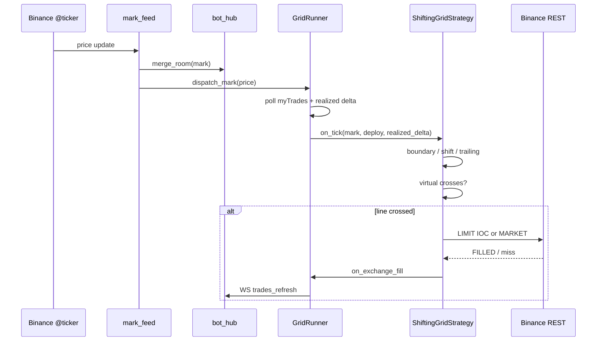
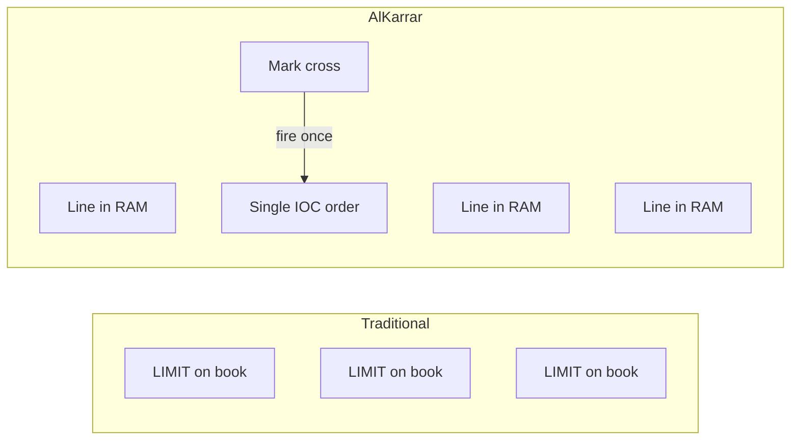
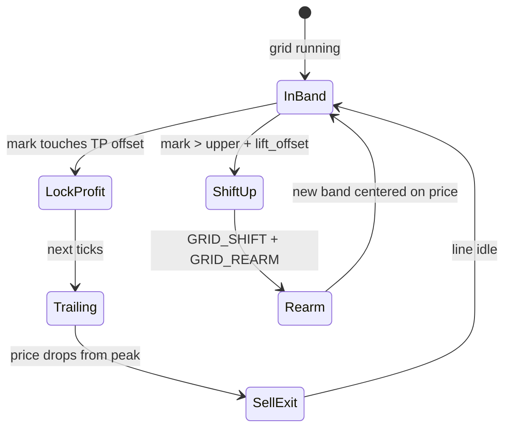
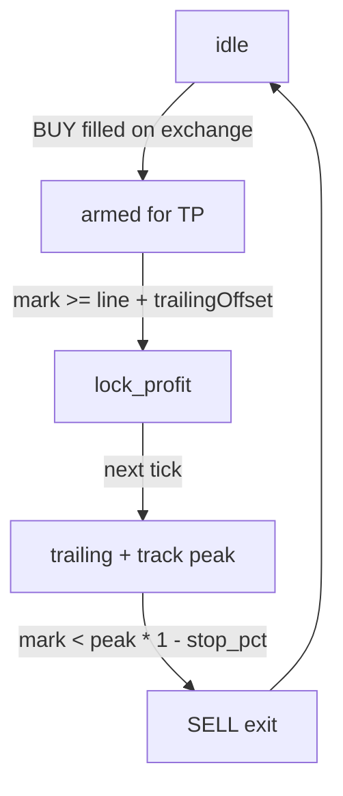
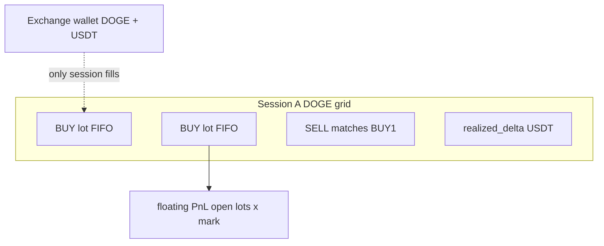
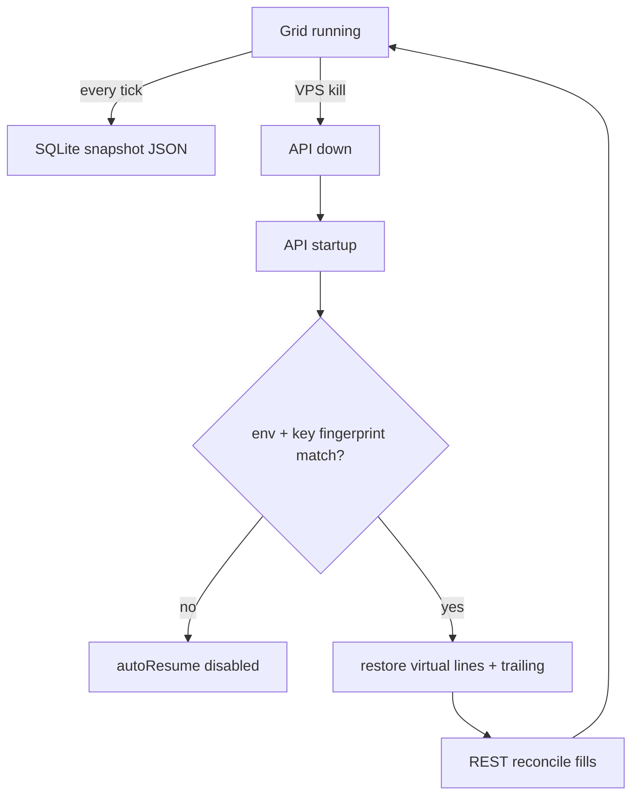
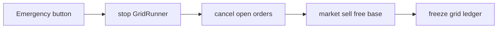
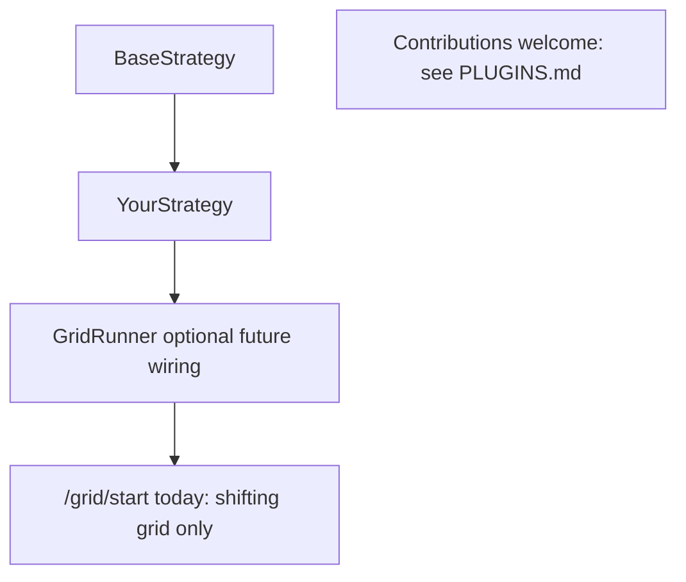

# Strategy diagrams (engineering reference)

Visual reference for contributors. Narrative: [TRADE_LOGIC.md](TRADE_LOGIC.md).

---

## 1. End-to-end tick flow

---

## 2. Virtual grid vs resting limits

---

## 3. Band shift (price breaks upper bound)

---

## 4. Trailing phases (one grid line)

---

## 5. Session isolation (PnL)

---

## 6. Crash recovery

---

## 7. Emergency stop

---

## 8. Adding your own strategy (plugin model)

