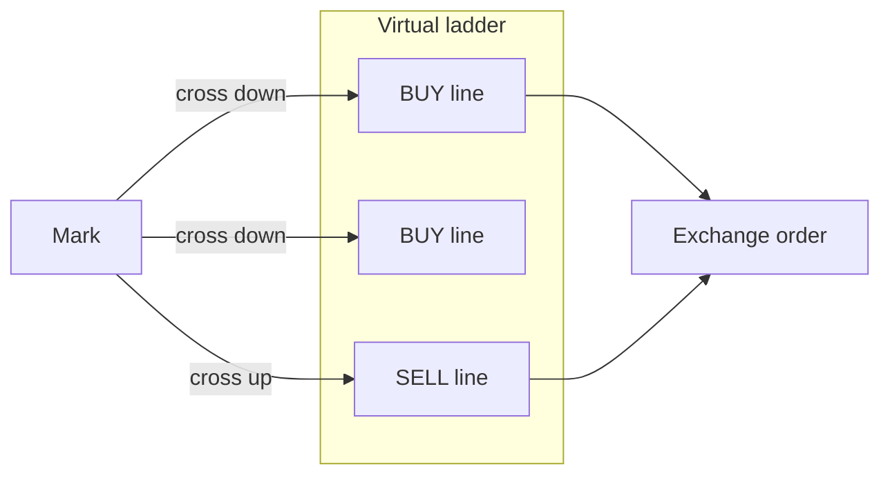

# AlKarrar Pro — Trade Logic & Strategy Whitepaper

This document explains **why** the shifting grid engine is built the way it is. For file-level maps, see [ARCHITECTURE.md](../ARCHITECTURE.md). For diagrams, see [STRATEGY_DIAGRAMS.md](STRATEGY_DIAGRAMS.md).

> **Contributors:** want a different approach? Add a new class implementing `BaseStrategy` — see [PLUGINS.md](PLUGINS.md).

---

## 1. Design goals

1. **Spot-only, inventory-aware** — No synthetic margin; sells are capped by session BUY lots (FIFO).
2. **Event-driven execution** — No full limit ladder on the book; virtual lines trigger on **mark crosses** (reduces order chatter and race conditions).
3. **Band that moves with trend** — When price escapes upward, the grid **shifts** instead of going idle off-band.
4. **Survivability** — Restart-safe snapshots, env/key guards, dedupe, and emergency flatten.

---

## 2. Virtual shifting grid (core loop)

### 2.1 What is “virtual”?

Traditional grids place many resting LIMIT orders on the exchange. AlKarrar keeps levels in RAM (`VirtualGridBook`) and only sends orders when:

- Mark **crosses** a line price (strict prev→current crossing), and
- Throttle allows (`ExecutionThrottle`), and
- Slippage vs line is within `ALKARRAR_GRID_MAX_SLIPPAGE_PCT`.

**Why:** Resting orders on volatile alts get picked off, require constant cancel/replace on band shift, and create partial state on the exchange. Virtual lines keep exchange state simpler: mostly IOC/market bursts tied to discrete events.

### 2.2 BUY / SELL classification

For a BUY-first grid at mark `M`:

- Lines **below** `M` → BUY candidates (buy dips).
- Lines **above** `M` → SELL candidates (take profit on rises).

After an **asymmetric shift** (see §4), only BUY lines may be re-armed until each BUY fill pairs with a deferred SELL (`PAIR_SELL_ARMED`).

### 2.3 Pre-flight: `validate_grid_economics`

Before start, the engine checks:

- `allocatedCapital / generatorCount ≥ ~11 USDT` (configurable minimum per line).
- Spacing between levels ≥ ~0.15% of price (fee round-trip guard).

**Why:** Binance `MIN_NOTIONAL` and taker fees make ultra-dense or tiny lines economically invalid — failing early avoids a running bot that only logs API errors.

Live **LOT_SIZE** and **PRICE_FILTER** come from `exchangeInfo` for the **detected env** at grid start.

---

## 3. Commissions and sizing

- Default taker fee assumption: **0.1%** (`ALKARRAR_SPOT_TAKER_FEE_RATIO`) for bootstrap math.
- Line size: `allocatedCapital / generatorCount`, quantized to exchange steps.
- **Compound resize:** When session realized profit exceeds `ALKARRAR_COMPOUND_RESIZE_PCT` × deploy, effective qty may increase (strategy RAM).

**Why:** Grid profit is eaten by fees if lines are too small or too close; compound logic reinvests only after measurable edge, not on every tick.

---

## 4. Grid shift (band recenter)

When mark exceeds `generatorUpper + lift_above_offset` and upper sell obligations are satisfied:

- Band width stays constant.
- `generatorUpper` / `generatorLower` recenter on current price (`GRID_SHIFT`).
- Virtual ladder re-arms (`GRID_REARM`, often `asymmetric_buys_only`).

**Why:** A static band on a trending coin leaves all action off-chart. Shifting follows liquidity while preserving spacing discipline.

**Lower band touch:** Enters `boundary_mode` (optional lot expansion from profit bank) — does **not** auto-shift down (different risk profile).

---

## 5. Trailing take-profit (per line)

Phases per line (`LineTrailPhase`):

1. **idle** — Waiting for BUY fill on that line (confirmed on exchange).
2. **lock_profit** — Mark touched `line_price + trailingOffset`.
3. **trailing** — Track peak; exit when mark drops `trailing_stop_pct` from peak (BUY-first).

`TRAILING_ARM` audit fires once per trailing cycle (requires `exchange_fill_confirmed` + session BUY on that line).

**Why:** Immediate market sell on TP touch leaves money on the table in spikes; trailing captures upside while capping give-back. Phantom trailing was blocked by resetting state without a confirmed BUY.

---

## 6. Bootstrap (optional inventory seed)

`ALKARRAR_GRID_BOOTSTRAP_MARKET=0` **(default off)**:

- No large opening MARKET buy for sell-ladder inventory.
- `bootstrap_defer` / `VIRTUAL_GRID_ARMED` — trade on crosses only.

When enabled (and within `ALKARRAR_GRID_BOOTSTRAP_MAX_DEPLOY_FRAC`), a MARKET buy may seed base for upper sell lines.

**Why:** Demo/mainnet users were hit with ~100% deploy MARKET buys on start — dangerous on mainnet and confusing on UI. Default off is safer for open source.

---

## 7. Session isolation & PnL

- **FIFO ledger** (`SpotGridRealizedLedger`) in each `GridRunner`.
- BUY lots consumed on SELL; `realized_delta` fed to compounding.
- **Floating PnL** = mark × open base − cost basis (UI).
- Journal shows **fills since grid start** for the session (not full exchange history).

**Why:** Wallet-wide PnL mixes unrelated holds; per-grid session PnL matches operator mental model (“this bot on DOGE”).

---

## 8. Anti-race condition toolkit

| Mechanism | Purpose |
|-----------|---------|
| `_line_fill_mutex` | One execution task per line at a time |
| `_line_ioc_cooldown_until` | 8s cooldown after IOC miss |
| `_filled_order_ids` + TTL | Prevent double-count fills |
| `grid_live_ledger` dedupe by `orderId` | Single UI row per exchange order |
| LIMIT IOC default | No resting stale limits |

---

## 9. Emergency stop

`emergency_service.execute_emergency_stop`:

1. Stop grid runner(s).
2. Cancel open orders on symbol(s).
3. Market-sell free base (respecting filters).
4. Freeze in-memory grid ledger.

Per-grid **trailing equity stop** (`portfolio_risk`) can trigger emergency for one symbol when isolated equity drawdown exceeds limit.

**Why:** Operator must have one guaranteed exit that does not depend on virtual line state.

---

## 10. Crash recovery & auto-resume

Periodic JSON snapshots in `shifting_grid_snapshots` include:

- Band, virtual line rows, trailing phases, asymmetric flags, `binanceEnv`, `credentialsFingerprint`.

On API startup:

1. Disable `autoResume` on snapshots whose env/key ≠ current.
2. Resume matching snapshots → restore RAM → `reconcile_downtime_fills` via REST.

Manual **grid stop** sets `autoResume=false`.

**Why:** VPS reboot should not require re-clicking start; demo→mainnet key change must not resume demo grids on real money.

---

## 11. Environment auto-detection

`probe_binance_env` tries signed `GET /account` on demo, mainnet, testnet.

**Why:** Operators paste keys without understanding three Binance hosts; wrong host → `-2015` and “broken bot”. Auto-detect removes mandatory `BINANCE_ENV` edits (hint still recommended).

---

## 12. Event glossary (audit / ledger)

| Event | Meaning |
|-------|---------|
| `VIRTUAL_GRID_ARMED` | Ladder ready; bootstrap deferred or disabled |
| `ORDER_BUY` / `ORDER_SELL` | Exchange fill from virtual cross |
| `TRAILING_ARM` | Trailing phase armed for a line |
| `GRID_SHIFT` / `AUTO_SHIFT_UP` | Band recentered |
| `GRID_REARM` | Ladder rebuilt after shift/compound |
| `PAIR_SELL_ARMED` | Sell line paired after asymmetric BUY |
| `EMERGENCY_STOP` | Forced flatten path |

---

## 13. What we intentionally do not do

- Futures / leverage / hedge mode.
- Guaranteed profitability or ML signals.
- Cross-exchange arbitrage.
- Unbounded martingale without deploy cap (deploy is capped per grid).

---

## Further reading

- Implementation: `backend/strategies/alkarrar_pro_shifting_grid.py`
- Tests: `backend/tests/test_trade_logic.py`, `test_grid_execution_safety.py`
- Operations: [AGENTS.md](../AGENTS.md)
